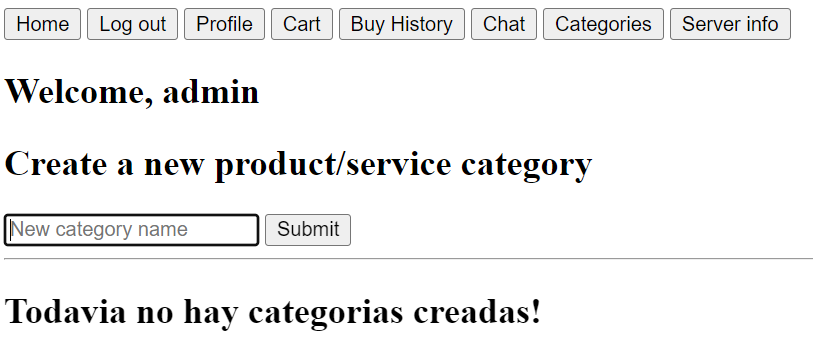

# Coderhouse backend, comision 32105

## 08/03/2023
#### Entrega Final

##### Consigna:
* Desarrollar el backend de una aplicacion **e-commerce** para poder vender productos de un rubro a elección

##### Deploy, testeo y funcionamiento:
1. Para hacer un deploy local, el primer paso es crear los archivos 50-EntregaFinal/config/dev.env y 50-EntregaFinal/config/prod.env con el siguiente formato:
````
# Configuracion de base de datos
mongoUrl=""                             # URL de conexión con una base de datos de mongo, puede ser
                                        # tanto local como remota en Atlas

# Configuracion de la app
PORT = 8081                             # Puerto desde el cual se va a ejecutar nuestro servidor

LAUNCH_MODE = 'standalone'              # Modo de ejecucion del servidor. 'standalone' ejecuta un
                                        # unico proceso, 'cluster' va a ejecutar un proceso por cada
                                        # nucleo de cpu disponible en el host donde vayamos a correrlo


#Configuracion de mail
SMTP_HOST="smtp.ethereal.email"         # Dominio de donde van a salir los correos
SMTP_PORT=587                           # Puerto por el que van a salir los correos (465, 587, 25, 2525, etc)
SMTP_SECURE=false                       # SSL, True para puerto 465, False para cualquier otro
SMTP_USER=""                            # Usuario registrado en el dominio de donde sacar los correos
SMTP_PASS=""                            # Contraseña del usuario definido arriba


ADMIN_PHONE_NUMBER=""                   # Este va a recibir un sms cada vez que se confirma una compra

ADMIN_ADDRESS="donny64@ethereal.email"  # Cuenta admin por default. Podemos tener tantos administradores como deseemos
                                        # modificando directamente el campo 'admin' de cada uno de nuestros usuarios 
                                        # en la base de datos, pero el usuario que esté registrado y su email matchee
                                        # con el aquí configurado va a ser administrador independientemente de lo que
                                        # su registro en la db diga


#Configuracion de twilio
TWILIO_SID=
TWILIO_AUTH_TOKEN=
TWILIO_NUMBER=
TWILIO_WHATSAPP_NUMBER=
````
Para evitar leakear credenciales o tokens privados, serán provistos a través de la plataforma de Coder los .env con los que estuve trabajando.

2. Ejecutar el servidor indicando por argv el entorno a utilizar. Dado que creamos dos archivos, un dev.env y un prod.env, las opciones son las siguientes:
````
npm run final dev
````
ó
````
npm run final prod
````
Cada una de ellas va a cargar su respectivo archivo. En caso de que no se le pase nada (haciendo npm run final) ó se le pase un entorno inexistente dentro de las opciones de configuración definidas dentro del código (por ejemplo npm run final QA), el programa va a defaultear a modo dev. Por último, en caso de que el archivo no exista o por algún motivo no sea posible leerlo, el programa va a intentar cargar un .env genérico en la raíz del proyecto (a la altura de este mismo readme, no adentro de 50-EntregaFinal/)

3. Si todo salió bien, tendremos el servidor en funcionamiento. Una consideración a tener en cuenta es que, a medida que fue avanzando el curso y esta entrega creció en complejidad, fui "diseñando"(si es que se le puede llamar de esa manera) la aplicación alrededor de su front, y las rutas a las que era posible acceder a través de postman o insomnia fueron siendo reemplazadas y/o eliminadas. Obviamente, con suficiente maña todo va a poder ser "emulado" a través de requests manuales, pero hasta ahora yo no pude recrear los resultados de passport al enviar la información por fuera de un navegador.

    1. Al acceder a nuestra web, lo primero que va a hacer falta es crear una cuenta. Recomiendo comenzar con la cuenta de administrador (definida por el *ADMIN_ADDRESS* que seteamos en nuestro .env) Para la instancia de esta app desplegada en railway, ya está creada la cuenta "admin" con contraseña "admin".  
    
    2. Una vez registrado se inicia sesión de manera automática, y lo primero con lo que nos encontramos es que si no se crean categorías no podemos crear productos:  
    
    3. Dirigiéndonos a /categorias (botón disponible en el menú superior si somos administradores) podemos generar una o varias siempre y cuando su nombre no esté ya cargado en esa colección:  
    
    4. Con la(s) categoría(s) ya cargada(s) se nos habilita el formulario de creación de productos y el botón de submit. El campo thumbnail es de tipo texto y hace referencia a una imagen externa, no a un archivo gestionado por multer:  
    
    5. Teniendo ya los productos, podemos agregarlos a nuestro carrito a través del botón que nos presenta su respectiva vista. Adicionalmente podemos darle click al hipervínculo en su respectivo id para entrar a la vista "detallada" pero dado que los productos no poseen descripción esa vista contiene la misma información sólo que con otro layout. Existe un único carrito por usuario, por diseño jamás debería lograrse que existan dos o más carritos para la misma persona. Los carritos se crean con la generación del perfil, se modifican agregando o quitando productos de su atributo 'items' (type Array) y se borran al transformarse en una compra.  
    
    6. En caso de concretarse la compra con el botón de arriba, la misma se realiza, el carrito se "transforma" en una compra y podemos acceder a ella a través del historial:  
    
    7. La app también cuenta con un chat, en el cual los usuarios logueados tienen la posibilidad de enviar mensajes de manera global, así como también filtrar los mensajes por remitente dándole click al hipervínclo que aparece en el campo 'sender'.  
      
      
-----------------
##### Bugs, faltantes y/o observaciones:
1. De vez en cuando y todavía no sé por qué (dado que no sucede SIEMPRE) al enviar un mensaje en el chat, este se sube dos veces. Y después de un par de ocasiones en el que sean dos, empiezan a ser tres. Y así ad aeternum. Esto desaparece una vez que bajas la aplicación y la volves a levantar pero genuinamente no sé qué es lo que lo causa.
2. Como se puede apreciar en las capturas, tengo un campo "Acciones" para cada uno de los mensajes cuyo único display es "Not implemented". La idea era hacer que los mensajes posean respuestas y que los administradores tengan la posibilidad de eliminar mensajes, pero no tuve tiempo.
3. Muy infrecuentemente, hay *algo* que el navegador no me puede resolver y al cambiar de pestaña dentro del sitio la respuesta puede tardar múltiples segundos en aparecer. Dándole su tiempo termina avanzando y el problema no se vuelve a manifestar hasta luego de un rato. Lo raro es que sucede en TODAS las vistas, por más ligeras que sean. Intuyo que puede tratarse de lentitudes ocasionales con Atlas dado que mi authControl chequea si el usuario es admin para cada request para poder determinar si renderizar o no el menú superior.


-----------------
-----------------
-----------------
-----------------
-----------------
-----------------
-----------------
-----------------
-----------------
-----------------
-----------------
-----------------
-----------------
-----------------
-----------------
-----------------
-----------------
-----------------
## 20/02/2023
#### Deno

###### PARA INSTALAR CHOCOLATEY
````
PS> Set-ExecutionPolicy Bypass -Scope Process -Force; [System.Net.ServicePointManager]::SecurityProtocol = [System.Net.ServicePointManager]::SecurityProtocol -bor 3072; iex ((New-Object System.Net.WebClient).DownloadString('https://community.chocolatey.org/install.ps1'))
````

###### PARA INSTALAR DENO
````
PS> choco install deno
````

###### PARA INSTALAR DENON
````
PS> deno install -qAf --unstable https://deno.land/x/denon/denon.ts
````

#### Para ejecutar el desafio

````
PS> deno run --allow-net .\48-Deno\app.tsx
````

## 15/02/2023
#### Reformar para usar otro framework (chosen: Koa)
````
> npm run koaproducts
````
* Rutas disponibles:
  * GET /
  * GET /productos
  * POST /productos
  * PUT /productos/:id
  * DELETE /productos/:id
* Se comporta de igual manera que los mismos endpoints hechos en express en la entrega de la clase 42

## 09/02/2023
````
> npm run graphql
````
* Queries disponibles:
  * getAllProducts
  * getProductById
* Mutations disponibles:
  * createNewProduct
  * updateProduct
  * deleteProduct

## 06/02/2023
#### Testing
````
> npm run axios
````
* Levanta el servidor tal como lo tenemos hasta ahora
  * Para testearlo con axios, hacer en paralelo npm run test-axios
  * Para testearlo con mocha, tirar abajo el servidor, y hacer npm run test-mocha

## 28/01/2023
#### Persistencia
````
> npm run persistencia
````
* Implementa un Object Interface / Factory para todos mis models/helpers de la db (totalmente redundante porque mis db/models/* exportan una única instancia de cada objeto, pero bueno.)
* Implementa DTOs para todos los objetos que deben ser insertados en la db (otra vez, innecesario, porque mis esquemas tienen todos los campos en required:true y uses o no un dto, te daría error intentar meter alguno vacío, pero bueno.)
* También modifica un detalle pavo que venía arrastrando desde que esto tiene un homepage y es que el formulario de creación de un producto no limpiaba sus campos luego de hacer submit
* Mete una vista de success una vez que realizas una compra para que sepas que todo anduvo bien
* (Ya mencioné que estoy cansado de este curso?)
## 21/01/2023
#### Arquitectura de capas
````
> npm run capas
````
* Separa la estructura de la aplicación entre:
  * Runtime(./app)
  * Funciones lógicas para las rutas (./controllers)
  * Esquemas de objetos de la db (./db/schemas)
  * Objetos de uso de dichos esquemas (./db/models) -- modelos propios de mongoose y helpers ya instanciados
  * Funciones de uso común entre las rutas (./helpers)
  * Endpoints de nuestro front-end que hacen uso de las funciones exportadas por los controladores (./routes)
  * Vistas en hbs y html (./views)

## 15/01/2023
#### Tercera entrega del proyecto final
````
> npm run terceraentrega (mismo CLI que las entregas anteriores pero dudo que haya beneficio en abrirlo en modo cluster/fork)
````
* Agrega rutas de carrito y de compras, mails y mensajes de whatsapp y sms. 

## 27/12/2022
#### Logs & Performance
````
> npm run logsnperf
````
Mismo CLI que la entrega anterior
## 11/12/2022
#### Proxy & Nginx
````
> npm run loadbalance <port, default: 8080>
````
* El servidor va a iniciar por default en modo standalone, con un solo nodo en el puerto especificado (u 8080 en caso de no pasarle nada/pasarle fruta)
````
> npm run loadbalance <port || default (8080)> cluster
````
* El servidor va a iniciar en modo cluster, abriendo en el puerto especificado un worker por cada nucleo de cpu disponible. Requiere que le pases **algo** como segundo argumento, si es un numero lo usa como puerto y si le pasas default/fruta/falopa hace la conversion al 8080. 
* Hacer npm run loadbalance *modo* sin especificar puerto va a salir por el primer if y arrancar en standalone, 8080.
````
> npm run loadbalance <port || default (8080)> fork
````
* El servidor va a iniciar en modo fork, spawneando un proceso de la aplicacion por cada nucleo de cpu disponible en puertos contiguos al especificado. Requiere que le pases **algo** como segundo argumento, si es un numero lo usa como puerto y si le pasas default/fruta/falopa hace la conversion al 8080. 
* Hacer npm run loadbalance *modo* sin especificar puerto va a salir por el primer if y arrancar en standalone, 8080.
  * ej: puerto 8080, tenemos 4 nucleos de cpu: se nos van a abrir 4 servidores en los puertos 8080, 8081, 8082 y 8083
## 04/12/2022
#### Process
* num run process \<port, default: 8080><br>
ó
* node ./28-Process/main.js \<port, default: 8080>
  * requiere mongoUrl="" en .env
  * rutas: GET /info, GET /api/random, GET /api/random?qty=\<Cantidad>


## 20/11/22
#### Inicio de sesion
* npm run auth
  requiere agregar en el .env un mongoUrl=""


## 17/11/22
#### Login
* rpm run login
  * requiere tener la base 'coderhouse' en mysql con la tabla productos, en caso de que no esté se puede generar con node 24-Login/db/* tal como se hizo en entregas anteriores. TODO para la proxima entrega reworkear esta porqueria para que use *SÓLO ATLAS* porque me estoy muriendo manejando tantas db desde la misma app
  * requiere cargar mongoUrl: '' dentro de mongoCreds en main.js
  * los campos no se limpian cuando cargas un producto porque el js se ejecuta antes que el POST y te arruina todo. se soluciona sacando por completo el form y haciéndolo como inputs de html comunes y corrientes que manejen todo a través del socket, pero no tuve tiempo de ajustarlo

## 09/11/22
#### Mocks y normalizacion
* npm run mocks
    * rutas: /, /api/productos-test
    * el centro de productos está medio roto (se siguen guardando en la base de datos y te los carga una vez que cargas la página, pero no se actualizan una vez que agregas uno nuevo). menos mal que no cabía dentro de esta entrega :)
    * una vez que envias un mensaje se limpia el valor del mensaje del front pero mantiene todos los demás datos, corrección recibida en la entrega de la clase #16
    * normalizr es una librería escrita por satanás y deberíamos estar agradecidos de que fue descontinuada
    * gracias maxifisz por tu ayuda

## 01/11/22
#### Segunda entrega del trabajo final
* npm run segundaentrega
    * rutas de productos:
        * GET /api/productos/
        * GET /api/productos/:id
        * POST /api/productos/ (mandando como json el objeto a insertar en el body)
        * PUT /api/productos/:id (mandando como json el objeto modificado en el body)
        * DELETE /api/productos/:id
    * rutas de carritos:
        * GET /api/carrito/
        * GET /api/carrito/:id/productos
        * POST /api/carrito/
        * DELETE /api/carrito/:id
        * POST /api/carrito/:id_carrito/productos/:id_producto
        * DELETE /api/carrito/:id_carrito/productos/:id_producto

Setear el motor de base de datos modificando el .env con:
````
dbType="mongo"
````
ó
````
dbType="firestore"
````
En el caso de firestore, se debe generar un archivo firestore-config.js dentro de 20-SegundaEntrega/helpers/firestore-config.js con el formato:
````
const firebase =  {
    "type": 
    "project_id": 
    "private_key_id": 
    "private_key": 
    "client_email":
    "client_id": 
    "auth_uri": 
    "token_uri": 
    "auth_provider_x509_cert_url": 
    "client_x509_cert_url": 
    }
module.exports = firebase;
````


## 22/10/22
### Primera base de datos
mi conexión con mysql estaba rotísima porque hace un tiempo desinstalé workbench, no se borró todo, y cuando lo instalé otra vez reventó por todos lados.\
para arreglarlo tuve que hacer:\
* ALTER USER 'root'@'localhost' IDENTIFIED WITH mysql_native_password BY 'root';
* FLUSH PRIVILEGES;
(obviamente se puede poner otra contraseña, pero está hardcodeada en 16-DecimoSexta-clase/db/maria*)\
Una vez arreglado eso, de haber sido necesario\
* Backend> node .\16-DecimoSexta-clase\db\mariaCreateDb.js
* Backend> node .\16-DecimoSexta-clase\db\mariaCreateTable.js
* Backend> node .\16-DecimoSexta-clase\db\sqliteCreateTable.js
y por último
* Backend > npm run wswithdb

## 07/10/22
### Primera entrega del trabajo final
* npm run primeraentrega
  * ruta de productos: /api
    * metodos: GET /api, GET /api/id, POST /api, PUT /api/id, DELETE /api/id
    * autorizacion por header, usar "isadmin":true
  * ruta de carritos: /carrito
    * metodos: POST /carrito, DELETE /carrito/id, GET /carrito/id/productos, POST /carrito/id1/productos/id2, DELETE /carrito/id1/productos/id2

## 22/09/22
### Sexto desafio, decimosegunda clase
* websockets, chat y esos yuyos
  * npm run websockets

## 14/09/2022
### Quinto desafio, decima clase
* Motores de plantillas: pug, ejs, handlebars
  * npm run pug
  * npm run ejs
  * npm run handlebars
* ¿Cuál prefiero?
  * Handlebars, es el más parecido a django de los 3 y aún si no conociera este segundo, me parece la forma más práctica de implementar variables